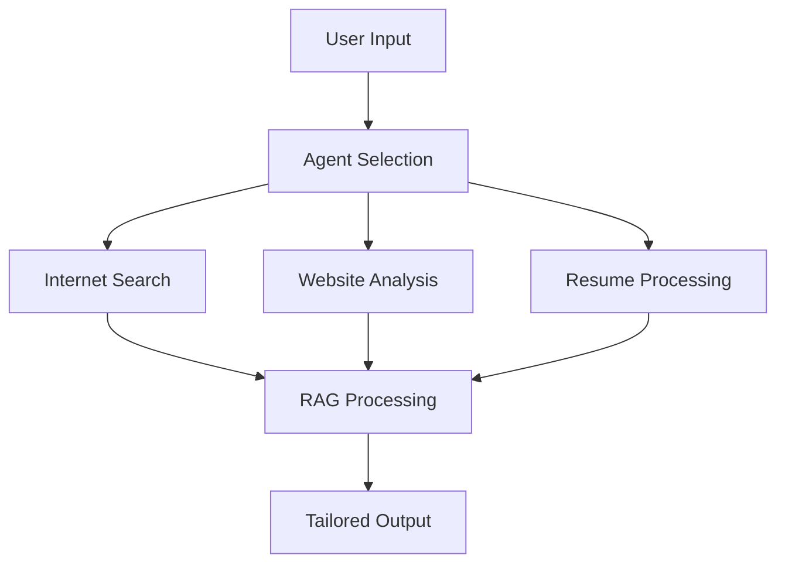
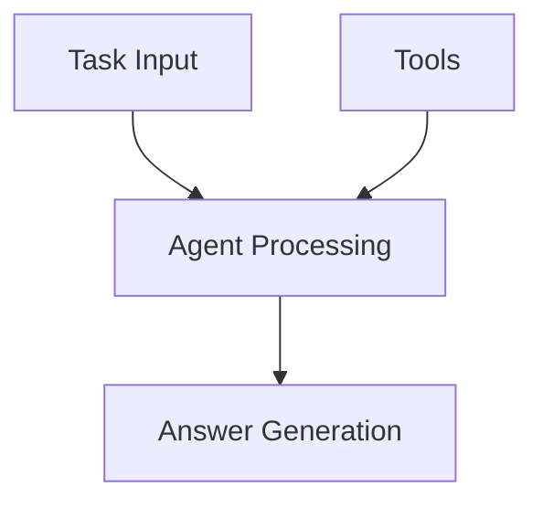
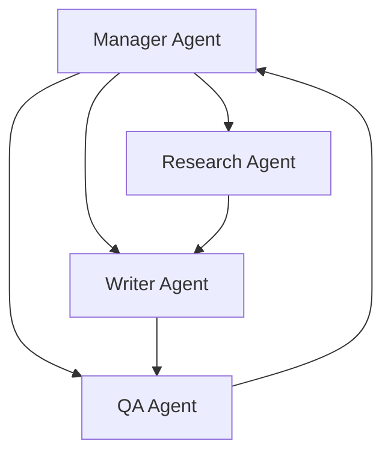
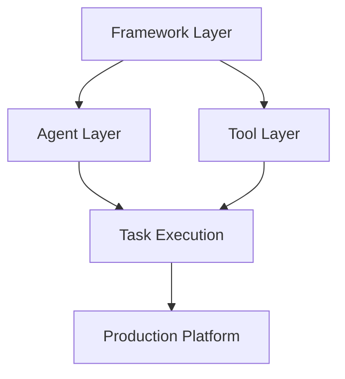
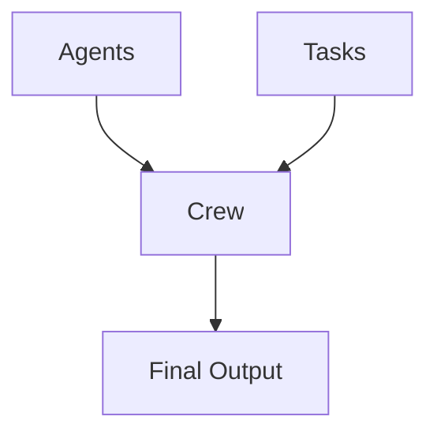

# Session 4 - Crew AI and Transformer Agents

# AI Agents for Engineering Career Development 🚀

## System Overview
This comprehensive system comprises four specialized AI agents working in harmony to optimize the engineering job search and career development process. Let's dive deep into each component and its functionalities.

## 1. The Four Specialized Agents 🤖

### Tech Job Researcher 🔍
```markdown
Primary Functions:
• Market analysis of tech job opportunities
• Industry trend identification
• Salary range research
• Company culture assessment
• Technology stack requirements analysis
```

### Personal Profiler for Engineers 👤
```markdown
Primary Functions:
• Professional profile optimization
• LinkedIn profile enhancement
• Personal brand development
• Skills matrix development
• Achievement quantification
```

### Resume Strategist for Engineers 📄
```markdown
Primary Functions:
• ATS optimization
• Technical skills highlighting
• Project impact quantification
• Keyword optimization
• Achievement metrics formatting
```

### Engineering Interview Preparer 💻
```markdown
Primary Functions:
• Technical interview preparation
• Behavioral question strategies
• System design practice
• Algorithm preparation
• Company-specific interview patterns
```

## 2. Core System Functionalities 🛠️

### 2.1 Internet Search Capabilities
```markdown
Features:
• Real-time job market analysis
• Industry trend monitoring
• Company research
• Technology stack popularity tracking
• Salary data aggregation
```

### 2.2 Website Reading & Analysis
```markdown
Capabilities:
• Job description parsing
• Company website analysis
• Industry news monitoring
• Technical blog comprehension
• Professional network scanning
```

### 2.3 Resume Analysis System
```markdown
Functions:
• Technical skill extraction
• Experience categorization
• Achievement identification
• Career progression analysis
• Gap identification
```

### 2.4 RAG Implementation 🔄

#### What is RAG?
Retrieval Augmented Generation (RAG) is an advanced AI technique that enhances the quality and accuracy of AI-generated content.

#### RAG Process Flow:
1. **Retrieval** 📥
   - Searches vast knowledge bases
   - Identifies relevant information
   - Filters for accuracy and relevance

2. **Augmentation** 🔄
   - Combines retrieved information
   - Contextualizes with current data
   - Integrates with base knowledge

3. **Generation** 📤
   - Produces tailored responses
   - Ensures accuracy and relevance
   - Maintains context consistency

## 3. Integration & Workflow 🔄

### System Architecture


## 4. Benefits & Applications 🎯

### Key Advantages
- **Comprehensive Coverage**: All aspects of job search
- **Specialized Expertise**: Domain-specific guidance
- **Real-time Updates**: Current market insights
- **Personalized Approach**: Tailored to individual profiles
- **Data-driven**: Evidence-based recommendations

## 5. Technical Implementation Notes 📝

### RAG Architecture
```markdown
Components:
1. Knowledge Base
2. Retrieval Engine
3. Context Processor
4. Generation Model
5. Output Optimizer
```

### Integration Points
- **API Endpoints**: For each agent's functionality
- **Data Flow**: Structured information exchange
- **Response Generation**: Contextualized outputs
- **Quality Assurance**: Accuracy verification

## Summary & Best Practices 📋

### Optimal Usage Guidelines
1. Start with clear career objectives
2. Provide comprehensive input data
3. Utilize multiple agents for best results
4. Review and iterate on recommendations
5. Keep profile information updated

### Success Metrics
- **Profile Enhancement**: Measured improvements
- **Interview Success Rate**: Tracking preparation effectiveness
- **Job Match Quality**: Alignment with career goals
- **Time Efficiency**: Reduced search duration

# AI Agent Task Processing System 🤖

## System Architecture Overview

### Core Components 🔄


## 1. Task Component 📋

### Input Processing
```markdown
• Task validation
• Context extraction
• Priority assignment
• Requirements analysis
• Constraint identification
```

### Task Types Handled
| Category | Description | Example |
|----------|-------------|----------|
| Analysis | Data processing & insights | Market research |
| Creation | Content generation | Document drafting |
| Planning | Strategy development | Project planning |
| Research | Information gathering | Technical studies |

## 2. Agent Component 🖥️

### Core Functionalities
```python
class Agent:
    def process_task(self):
        # Task interpretation
        # Tool selection
        # Processing logic
        # Output generation
```

### Agent Capabilities
- **Task Understanding**: Natural language processing
- **Context Awareness**: Situational adaptation
- **Tool Integration**: Resource utilization
- **Output Optimization**: Quality assurance

## 3. Tools Integration ⚙️

### Tool Categories
```markdown
1. Analysis Tools
   • Data processors
   • Pattern recognizers
   • Statistical analyzers

2. Creation Tools
   • Content generators
   • Format converters
   • Quality checkers

3. Support Tools
   • Memory management
   • Resource allocation
   • Performance monitors
```

### Tool Selection Logic
- **Task Requirements**: Based on input needs
- **Resource Availability**: System capacity
- **Optimization Goals**: Performance targets
- **Quality Standards**: Output requirements

## 4. Answer Generation 📤

### Output Processing
```markdown
• Result validation
• Format optimization
• Quality assurance
• Delivery preparation
```

### Answer Types
| Type | Characteristics | Use Case |
|------|----------------|-----------|
| Text | Formatted content | Reports |
| Data | Structured information | Analysis |
| Visual | Graphics/charts | Presentations |
| Code | Executable solutions | Development |

## 5. System Flow 🔄

### Process Sequence
1. **Task Reception**
   - Input validation
   - Priority assignment
   - Resource allocation

2. **Agent Activation**
   - Context loading
   - Tool selection
   - Processing initialization

3. **Tool Utilization**
   - Resource integration
   - Function execution
   - Result collection

4. **Answer Production**
   - Output formatting
   - Quality verification
   - Delivery preparation

## 6. Performance Optimization 📈

### Metrics Monitoring
```markdown
• Response time
• Resource utilization
• Output quality
• System efficiency
```

### Optimization Strategies
- **Load Balancing**: Resource distribution
- **Cache Management**: Quick retrieval
- **Process Streamlining**: Workflow optimization
- **Quality Control**: Output verification

## 7. System Benefits 🎯

### Key Advantages
- **Efficiency**: Rapid task processing
- **Accuracy**: Precise outputs
- **Scalability**: Adaptable architecture
- **Reliability**: Consistent performance

## Implementation Guidelines 📝

### Best Practices
1. **Clear Task Definition**
   - Specific requirements
   - Measurable outcomes
   - Time constraints

2. **Tool Selection**
   - Appropriate resources
   - Performance optimization
   - Integration efficiency

3. **Quality Assurance**
   - Output validation
   - Performance monitoring
   - Continuous improvement

# CrewAI: Autonomous AI Agent Teams Framework 🤖

## Overview
CrewAI is an innovative framework for orchestrating role-playing AI agents that work together to accomplish complex tasks. Think of it as a "virtual company" where each AI agent has specific roles and responsibilities.

## Core Components 🔧

### 1. Agent Architecture
```python
from crewai import Agent, Task, Crew

# Example Agent Definition
researcher = Agent(
    role='Research Analyst',
    goal='Conduct deep market research',
    backstory='Expert in data analysis with MBA',
    tools=[SearchTool(), AnalysisTool()]
)
```

### 2. Key Features 🌟

| Feature | Description | Benefit |
|---------|-------------|----------|
| Role-Based Agents | Specialized AI agents with defined roles | Better task specialization |
| Hierarchical Structure | Organized team workflows | Efficient task management |
| Tool Integration | Custom tool support | Enhanced capabilities |
| Memory Systems | Context retention across tasks | Improved continuity |

## Working Principles 📚

### 1. Agent Collaboration


### 2. Task Processing Flow
1. **Task Assignment** 📋
   - Role-specific distribution
   - Clear objective setting
   - Resource allocation

2. **Execution Process** ⚙️
   - Collaborative problem-solving
   - Inter-agent communication
   - Progress monitoring

3. **Quality Control** ✅
   - Output verification
   - Peer review
   - Iteration management

## Implementation Examples 💻

### Basic Crew Setup
```python
# Creating a research crew
crew = Crew(
    agents=[researcher, writer, reviewer],
    tasks=[research_task, writing_task, review_task],
    workflow='sequential'
)

# Execute crew tasks
result = crew.kickoff()
```

### Common Use Cases 🎯

1. **Business Analytics**
   - Market research
   - Competitor analysis
   - Trend forecasting

2. **Content Creation**
   - Article writing
   - Report generation
   - Documentation

3. **Project Management**
   - Task coordination
   - Resource allocation
   - Progress tracking

## Best Practices 📌

### Setting Up Effective Crews
1. **Clear Role Definition**
   - Specific responsibilities
   - Distinct capabilities
   - Well-defined objectives

2. **Optimal Team Structure**
   - Complementary skills
   - Efficient workflows
   - Clear hierarchy

3. **Tool Integration**
   - Relevant capabilities
   - Custom tools
   - API integration

## Advanced Features 🚀

### 1. Memory Systems
```python
# Implementing agent memory
agent = Agent(
    role="Analyst",
    memory=LongTermMemory(),
    memory_window=10
)
```

### 2. Custom Tools Integration
- API connections
- Database access
- External service integration

## Performance Optimization 📈

### Key Metrics
- Task completion rate
- Processing time
- Output quality
- Resource utilization

### Improvement Strategies
1. **Workflow Optimization**
   - Process streamlining
   - Bottleneck identification
   - Resource allocation

2. **Agent Enhancement**
   - Skill development
   - Tool optimization
   - Memory management

## Conclusion 🎭

CrewAI represents a powerful paradigm shift in AI agent orchestration, enabling complex task completion through collaborative AI teams. Its flexible architecture and robust features make it suitable for various applications requiring coordinated AI effort.

Visit [crewai.com](https://crewai.com) for detailed documentation and implementation guides.


# CrewAI Framework & Platform Breakdown 🏗️

## 1. Framework Structure 🔄

### Simple Structures
```python
# Core Components
class CrewAI:
    1. Agents       # Worker units
    2. Tasks        # Work items
    3. Tools        # Capabilities
    4. Workflows    # Process flows
```

## 2. Core Components Breakdown 📦

### A. Agents 🤖
```markdown
Structure:
1. Role Definition
   • Title
   • Goals
   • Skills
   • Backstory

2. Capabilities
   • Tools access
   • Knowledge base
   • Interaction patterns
```

### B. Tasks 📋
```markdown
Components:
1. Description
   • Clear objective
   • Expected output
   • Success criteria

2. Dependencies
   • Required tools
   • Input data
   • Prerequisites
```

### C. Tools 🛠️
```markdown
Categories:
1. Built-in Tools
   • Web search
   • Data analysis
   • Content creation

2. Custom Tools
   • API integrations
   • Specialized functions
   • Domain-specific utilities
```

## 3. System Integration Pattern 🔗



## 4. Built-in Tools & Skills 🎯

### Ready-to-Use Capabilities
| Tool Type | Purpose | Example Usage |
|-----------|---------|---------------|
| Research | Information gathering | Market analysis |
| Analysis | Data processing | Pattern recognition |
| Creation | Content generation | Report writing |
| Planning | Strategy development | Project planning |

### Implementation
```python
# Using built-in tools
agent = Agent(
    role="Researcher",
    tools=[
        SearchTool(),
        AnalysisTool(),
        WritingTool()
    ]
)
```

## 5. Custom Tool Development 🔧

### Structure Template
```python
class CustomTool(BaseTool):
    def __init__(self):
        self.name = "Custom Tool"
        self.description = "Tool purpose"
        
    def execute(self, input_data):
        # Tool logic here
        return result
```

### Integration Process
1. **Tool Definition**
   - Functionality specification
   - Input/output format
   - Error handling

2. **Agent Integration**
   - Tool assignment
   - Permission setup
   - Usage parameters

## 6. Production Platform Features 🚀

### A. Deployment Options
```markdown
1. Cloud Deployment
   • Scalable infrastructure
   • Managed services
   • Monitoring systems

2. Local Deployment
   • Development environment
   • Testing setup
   • Resource management
```

### B. Monitoring & Management
```markdown
1. Performance Tracking
   • Resource usage
   • Task completion
   • Error rates

2. System Health
   • Agent status
   • Tool availability
   • Network health
```

## 7. Implementation Example 💻

```python
# Complete system setup
from crewai import Agent, Task, Crew, Tool

# Custom tool definition
class MarketAnalysisTool(Tool):
    def execute(self, market_data):
        # Analysis logic
        return analysis_result

# Agent setup
analyst = Agent(
    role="Market Analyst",
    tools=[MarketAnalysisTool()],
    goals=["Accurate market insights"]
)

# Task definition
analysis_task = Task(
    description="Analyze market trends",
    agent=analyst,
    expected_output="Market report"
)

# Crew assembly
crew = Crew(
    agents=[analyst],
    tasks=[analysis_task]
)

# Execute in production
result = crew.kickoff()
```

## 8. Best Practices 📌

### System Design
1. **Modular Structure**
   - Separate concerns
   - Reusable components
   - Clear interfaces

2. **Scalable Architecture**
   - Resource efficiency
   - Performance optimization
   - Error handling

### Production Deployment
1. **Testing Protocol**
   - Unit testing
   - Integration testing
   - Performance testing

2. **Monitoring Setup**
   - Log management
   - Alert systems
   - Performance metrics

This framework provides a structured approach to building and deploying AI agent systems, with flexibility for customization and scalability for production use.

# Building Multi-AI Agent Systems with CrewAI - Article Creation Example 📝

## 1. Initial Building Blocks 🏗️

### Core Components Overview


## 2. Agent Definitions 🤖

```python
from crewai import Agent, Task, Crew

# Research Agent
research_agent = Agent(
    role="Research Specialist",
    goal="Conduct comprehensive research on topics",
    backstory="Experienced research analyst with expertise in data collection",
    tools=[SearchTool(), AnalysisTool()],
    verbose=True
)

# Writing Agent
writer_agent = Agent(
    role="Content Writer",
    goal="Create engaging and informative articles",
    backstory="Professional writer with expertise in technical content",
    tools=[WritingTool(), GrammarTool()],
    verbose=True
)

# Editor Agent
editor_agent = Agent(
    role="Content Editor",
    goal="Ensure article quality and accuracy",
    backstory="Senior editor with attention to detail",
    tools=[EditingTool(), FactCheckTool()],
    verbose=True
)
```

## 3. Task Definitions 📋

```python
# Research Task
research_task = Task(
    description="""
    Conduct thorough research on [topic]:
    - Gather key information
    - Identify main points
    - Collect relevant statistics
    - Find credible sources
    """,
    agent=research_agent
)

# Writing Task
writing_task = Task(
    description="""
    Create an article based on research:
    - Develop outline
    - Write engaging content
    - Include key findings
    - Format properly
    """,
    agent=writer_agent
)

# Editing Task
editing_task = Task(
    description="""
    Review and polish the article:
    - Check accuracy
    - Improve clarity
    - Fix grammar
    - Ensure style consistency
    """,
    agent=editor_agent
)
```

## 4. Crew Assembly 👥

```python
# Create Article Creation Crew
article_crew = Crew(
    agents=[research_agent, writer_agent, editor_agent],
    tasks=[research_task, writing_task, editing_task],
    workflow="sequential"
)

# Execute the Process
result = article_crew.kickoff()
```

## 5. Process Flow 🔄

### A. Research Phase
```markdown
1. Topic Analysis
   • Main concepts identification
   • Key questions formulation
   • Source identification

2. Data Collection
   • Information gathering
   • Fact verification
   • Source documentation
```

### B. Writing Phase
```markdown
1. Content Structure
   • Outline creation
   • Section planning
   • Key points organization

2. Content Development
   • Draft writing
   • Example inclusion
   • Citation integration
```

### C. Editing Phase
```markdown
1. Quality Check
   • Accuracy verification
   • Style consistency
   • Grammar review

2. Final Polish
   • Flow improvement
   • Format checking
   • Final proofreading
```

## 6. Implementation Tips 💡

### A. Agent Configuration
| Agent Type | Key Skills | Tools |
|------------|------------|-------|
| Researcher | Data gathering, Analysis | SearchTool, AnalysisTool |
| Writer | Content creation, Structure | WritingTool, GrammarTool |
| Editor | Quality control, Polish | EditingTool, FactCheckTool |

### B. Task Optimization
```python
# Task Dependencies
writing_task.set_dependency(research_task)
editing_task.set_dependency(writing_task)

# Task Prioritization
crew.set_priority(research_task, 1)
crew.set_priority(writing_task, 2)
crew.set_priority(editing_task, 3)
```

## 7. Example Usage 💻

```python
# Complete Article Creation System
def create_article(topic, requirements):
    # Initialize agents
    agents = initialize_agents()
    
    # Create tasks
    tasks = create_tasks(topic, requirements)
    
    # Assemble crew
    crew = Crew(
        agents=agents,
        tasks=tasks,
        workflow="sequential"
    )
    
    # Execute and return result
    return crew.kickoff()

# Usage
article = create_article(
    topic="AI Trends 2024",
    requirements={
        "word_count": 1500,
        "style": "technical",
        "audience": "professionals"
    }
)
```

## 8. Output Handling 📤

### A. Result Processing
```python
def process_article(result):
    # Extract content
    content = result.get_content()
    
    # Format output
    formatted_article = {
        "title": content.title,
        "body": content.body,
        "sources": content.sources,
        "metadata": content.metadata
    }
    
    return formatted_article
```

### B. Quality Assurance
```python
def verify_article(article):
    # Quality checks
    checks = {
        "length": check_length(article),
        "style": check_style(article),
        "sources": verify_sources(article),
        "grammar": check_grammar(article)
    }
    
    return checks
```

## 9. Best Practices 📌

1. **Agent Configuration**
   - Clear role definition
   - Specific goals
   - Appropriate tools

2. **Task Management**
   - Clear dependencies
   - Proper sequencing
   - Quality criteria

3. **Output Quality**
   - Regular verification
   - Source checking
   - Style consistency

| Course Name | Platform | Instructor | Duration | Level | Description | Link |
|------------|----------|------------|----------|--------|-------------|------|
| Practical Multi AI Agents and Advanced Use Cases with crewAI | DeepLearning.AI | João Moura | 2h 43m | Beginner | Build practical apps like automated project planning, lead-scoring, and data analysis with 15 video lessons and 7 code examples[1] | https://www.deeplearning.ai/short-courses/practical-multi-ai-agents-and-advanced-use-cases-with-crewai/ |
| CrewAI Step-by-Step Complete Course | YouTube | Alejandro AO | 1h 06m | Beginner | Comprehensive tutorial on creating autonomous agent teams with hands-on coding and real-world examples[2] | https://www.youtube.com/watch?v=kBXYFaZ0EN0 |
| Multi AI Agent Systems with crewAI | DeepLearning.AI | João Moura | 2h 42m | Beginner | Learn to design and organize AI agent teams with 19 video lessons and 7 practical examples[3] | https://www.deeplearning.ai/short-courses/multi-ai-agent-systems-with-crewai/ |
| Multi AI Agent Systems with crewAI (1-Hour Project) | Coursera | Joe Moura | 1h | Beginner | Hands-on project focusing on practical implementation of AI agent systems[4] | https://www.coursera.org/projects/multi-ai-agent-systems-with-crewai |
| Crew AI Tutorial | Simplilearn | - | - | Beginner | Introduction to AI-driven workplace solutions and implementation[5] | https://www.simplilearn.com/tutorials/generative-ai-tutorial/crew-ai |


