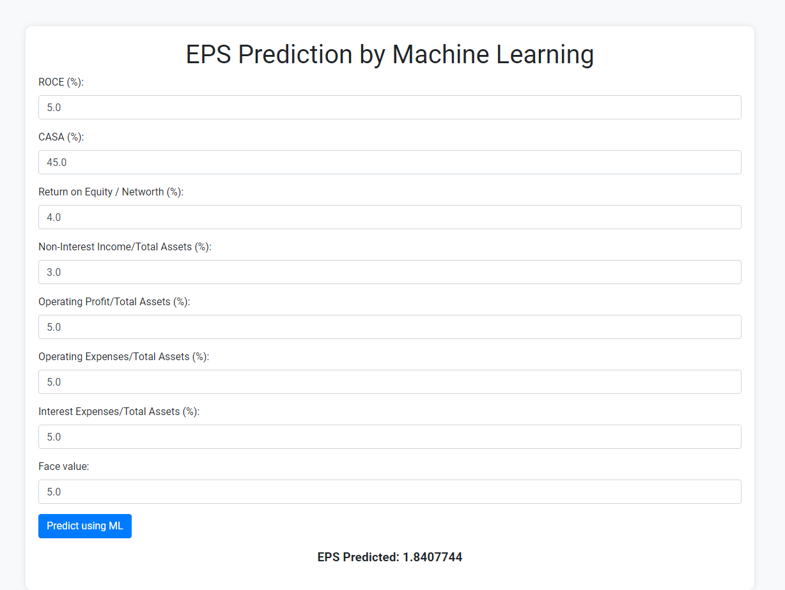

# Session 4 - Model Serving and Deployment

In machine learning, hyperparameter tuning is the crucial process of finding the best possible settings for a model's hyperparameters. These hyperparameters are distinct from regular model parameters in that they are set before the training process even begins, and they control how the model learns from data.

Here's a breakdown of hyperparameter tuning:

**Understanding Hyperparameters:**

* Regular model parameters: These are the coefficients or weights that the model itself learns during training. They directly depend on the data you provide. Imagine the slope and intercept of a linear regression line – these are learned parameters.
* Hyperparameters: These are settings that exist outside the model and influence how it learns. They define the learning algorithm's behavior. Examples include the learning rate in gradient descent, the number of hidden layers in a neural network, or the kernel size in a support vector machine.

**The Tuning Process:**

The goal of hyperparameter tuning is to identify the combination of hyperparameter values that leads to the best performance on a specific task. This typically involves:

1. **Experimentation:**  You train the model with various sets of hyperparameter values. This can be done manually, trying out different combinations, or through automated methods like grid search or random search.
2. **Evaluation:**  For each set of hyperparameters, you evaluate the model's performance using a metric like accuracy or loss function. This helps gauge how well the model performs on unseen data.
3. **Selection:**  By comparing the evaluation results, you choose the set of hyperparameters that yields the optimal performance according to your chosen metric.

**Why is it Important?**

Hyperparameter tuning is essential in machine learning because it significantly impacts a model's effectiveness. Improperly tuned hyperparameters can lead to:

* **Underfitting:** The model fails to capture the underlying patterns in the data, resulting in poor performance.
* **Overfitting:** The model memorizes the training data too closely, losing its ability to generalize to new data.

By carefully tuning hyperparameters, you can:

* Improve the model's accuracy and generalization capability.
* Reduce the risk of overfitting or underfitting.
* Achieve the best possible results for your specific machine learning task.

**Additional Considerations:**

* There's no one-size-fits-all approach to hyperparameter tuning. The optimal values will depend on the specific model, dataset, and task.
* Techniques like cross-validation are often used to ensure the chosen hyperparameters perform well on unseen data.
* Hyperparameter tuning can be an iterative process. As you gain insights from your experiments, you can refine your search for even better hyperparameter combinations.



**Title: A Beginner's Guide to Deploying Python Code using Flask and Running it Locally**

In the world of web development, Python has gained immense popularity due to its simplicity and versatility. Flask, a micro web framework written in Python, provides an easy and efficient way to deploy web applications. In this guide, we'll walk through the process of deploying Python code using Flask and running it locally on your machine.

### Prerequisites
Before we dive into the deployment process, make sure you have the following installed on your system:
1. Python: Ensure Python is installed on your machine. You can download it from the official Python website.
2. Flask: Install Flask using pip, the Python package manager. You can install Flask by running the command `pip install Flask` in your terminal or command prompt.

### Setting up the Project
1. **Create a Project Directory**: Start by creating a directory for your project. Navigate to this directory in your terminal or command prompt.

2. **Project Structure**: Inside your project directory, create the following files:
   - `app.py`: This file will contain your Flask application code.
   - `index.html`: Create an HTML template for your web page.

### Writing the Flask Application
Now, let's write the Python code for our Flask application. Open the `app.py` file and add the following code:

```python
from flask import Flask, render_template, request
import pickle

app = Flask(__name__)

# Load the model
model = pickle.load(open('model.pkl', 'rb'))

# Home page
@app.route('/')
def home():
    return render_template('index.html')

@app.route('/predict', methods=['POST'])
def predict():
    if request.method == 'POST':
        # Retrieve form data
        v1 = request.form.get('ROCE (%)', type=float)
        v2 = request.form.get('CASA (%)', type=float)
        # Add more variables as needed
        
        # Make prediction
        result = model.predict([[v1, v2]])[0]  # Modify according to your model
        
        # Pass input values and result back to the template
        return render_template('index.html', result=result, v1=v1, v2=v2)  # Add more variables as needed
    else:
        # If GET request, redirect to home page
        return redirect('/')

if __name__ == '__main__':
    app.run(debug=True)
```

### Creating the HTML Template
Create an HTML file named `index.html` in the project directory. This file will contain the structure of your web page and the form to input data. Here's a simple example:

```html
<!DOCTYPE html>
<html lang="en">
<head>
    <meta charset="UTF-8">
    <meta name="viewport" content="width=device-width, initial-scale=1.0">
    <title>Model Prediction</title>
</head>
<body>
    <h1>Model Prediction</h1>
    <form action="/predict" method="post">
        <label for="ROCE">ROCE (%):</label>
        <input type="text" id="ROCE" name="ROCE"><br><br>
        
        <label for="CASA">CASA (%):</label>
        <input type="text" id="CASA" name="CASA"><br><br>
        <!-- Add more input fields as needed -->
        
        <input type="submit" value="Submit">
    </form>
    
        <h2>Prediction Result: {{ result }}</h2>
    
</body>
</html>
```

### Running the Application
To run the Flask application, execute the `app.py` file in your terminal or command prompt:
```
python app.py
```

Once the application is running, open a web browser and go to `http://127.0.0.1:5000` to access your locally deployed Flask application. You should see the home page with the input form. Enter the required data, submit the form, and see the prediction result displayed on the page.

Congratulations! You have successfully deployed Python code using Flask and are now running it locally on your machine. You can further enhance your application by adding more features, improving the user interface, and deploying it to a production server for wider access.

**Title: Converting Python Files to Executable (.exe) Using PyInstaller**

Converting Python scripts into standalone executable files is a convenient way to distribute applications, especially when users don't have Python installed on their systems. PyInstaller is a popular tool that automates the process of converting Python scripts into executable files for various platforms, including Windows, macOS, and Linux. In this guide, we'll walk through the steps of using PyInstaller to convert a Python file into a Windows executable (.exe).

### Prerequisites
Before we begin, ensure you have the following:
1. Python: Make sure Python is installed on your system. You can download it from the official Python website.
2. PyInstaller: Install PyInstaller using pip, the Python package manager. You can install PyInstaller by running the command `pip install pyinstaller` in your terminal or command prompt.

### Conversion Process
Follow these steps to convert a Python file into a Windows executable (.exe):

#### Step 1: Navigate to the Directory
Open your terminal or command prompt and navigate to the directory containing your Python script (`exe.py` in this case). You can use the `cd` command to change directories. For example:
```
cd C:\xxxx\Desktop\New folder
```

#### Step 2: Run PyInstaller
Once you're in the correct directory, run PyInstaller with the following command:
```
python -m PyInstaller --onefile exe.py
```
Replace `exe.py` with the name of your Python script. This command tells PyInstaller to create a single executable file (`--onefile`) from your Python script.

#### Step 3: Wait for the Process to Complete
PyInstaller will start analyzing your Python script and its dependencies. Depending on the complexity of your script and the number of dependencies, this process may take some time. PyInstaller will create a `dist` directory in your project folder, containing the generated executable file.

#### Step 4: Locate the Executable
Once PyInstaller has finished, navigate to the `dist` directory in your project folder. You should see a single executable file with the same name as your Python script, but with the `.exe` extension.

#### Step 5: Test the Executable
Double-click the generated `.exe` file to run it. This will execute your Python script as a standalone application. Test the executable thoroughly to ensure it functions as expected.

### Conclusion
Congratulations! You have successfully converted your Python script into a Windows executable using PyInstaller. You can now distribute this executable to users who do not have Python installed on their systems. PyInstaller simplifies the process of creating standalone executables, making it easier to share and distribute Python applications.
