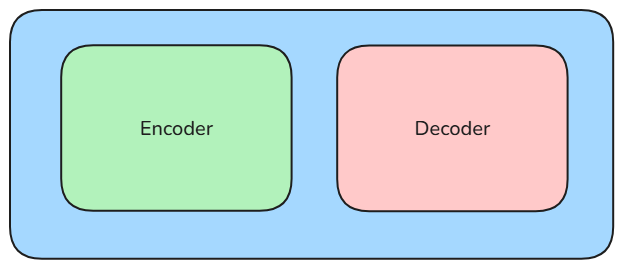

# Fundamentals of Transformers | Part 1

## Course Structure:
1. Brief Introduction to Transformers and HuggingFace Ecosystem.
2. Fine Tuning T5 Transformer for text summarization using HuggingFace.
3. Brief introduction to BERT and GPT.
4. Fine Tuning GPT for text Generation using ( HuggingFace )
5. Fine Tuning BERT for NER detection using HuggingFace

### Transformers

#### 1. **Introduction to Transformers**
   - Transformers are a type of deep learning model architecture introduced in the paper "Attention is All You Need" (2017) by Vaswani et al.
   - They are designed to handle sequential data, especially suited for natural language processing (NLP) tasks.
   - Unlike traditional RNNs (Recurrent Neural Networks), Transformers do not rely on sequential processing; instead, they use self-attention mechanisms to weigh the significance of different parts of the input sequence.

#### 2. **Why Transformers Were Needed**
   - Traditional models like RNNs and LSTMs struggled with long sequences due to the vanishing gradient problem and their sequential nature, which made them inefficient for long-distance dependencies.
   - Transformers overcome these issues by using **self-attention** mechanisms that allow parallelization, making the processing more efficient and enabling the model to capture long-range dependencies effectively.

#### 3. **Key Components of Transformers**
   - The Transformer architecture mainly consists of **Encoder** and **Decoder** stacks:
     - The **Encoder** reads the input sequence and generates a representation.
     - The **Decoder** takes this representation to generate the output sequence, such as a translation or response in a dialogue.

#### 4. **Self-Attention Mechanism**
   - **Self-Attention** allows each word (or token) in a sentence to attend to every other word, enabling the model to consider the full context of the sentence.
   - In simple terms, self-attention calculates how much focus each word should have on every other word in the sentence.
   - For each word, it creates a **Query (Q)**, **Key (K)**, and **Value (V)**.
     - **Query** represents the word we’re focusing on.
     - **Key** represents all the words in the sentence.
     - **Value** is used to calculate the output based on the importance derived from the Query-Key match.
   - The similarity between **Q** and **K** (measured by dot products and normalized by a softmax function) gives attention scores that dictate the focus on other words.

#### 5. **Multi-Head Attention**
   - Multi-head attention enhances the model’s ability to attend to information from different representation subspaces.
   - Instead of applying a single attention mechanism, multiple attention heads work in parallel, each learning different relationships and combining to form a richer understanding of the context.

#### 6. **Position Encoding**
   - Since Transformers do not have a built-in mechanism to understand the order of words, **Positional Encoding** is added to the input embeddings to provide a sense of order or position in the sequence.
   - Positional encoding typically uses a combination of sine and cosine functions at different frequencies to encode positions in a fixed dimension.

#### 7. **Encoder-Decoder Architecture**
   - **Encoder:** The encoder consists of multiple layers of multi-head attention and position-wise feed-forward layers. It processes the input sequence and encodes it into a higher-dimensional representation.
   - **Decoder:** The decoder also consists of multiple layers but includes an additional layer for attention on the encoder output. This enables the decoder to focus on specific parts of the encoded input representation.

#### 8. **Feed-Forward Neural Network**
   - After attention layers, each position in the sequence is passed through a feed-forward neural network with two linear transformations and a ReLU activation in between.
   - This is applied identically to each position, contributing to non-linearity in the model.

#### 9. **Layer Normalization and Residual Connections**
   - **Layer Normalization:** Applied after the attention and feed-forward layers, it helps stabilize and improve convergence by normalizing layer inputs.
   - **Residual Connections:** Residual (or skip) connections are added around each layer to facilitate gradient flow and ease training of deeper architectures.

#### 10. **Training and Optimization**
   - Transformers are typically trained with a variant of **stochastic gradient descent** and use the **Adam optimizer** with learning rate warm-up and scheduling.
   - Training transformers is computationally intensive, so they require significant computational resources and large datasets to achieve state-of-the-art performance.

#### 11. **Applications of Transformers**
   - **Language Translation:** E.g., Google Translate utilizes transformers for accurate language translation across different languages.
   - **Text Summarization:** Summarizing large documents or articles by condensing them to main points.
   - **Sentiment Analysis:** Assessing sentiment within text data, important for social media and customer service.
   - **Question Answering:** Powering search engines and virtual assistants by providing precise answers to questions.
   - **Image Processing:** Vision transformers (ViTs) adapt transformers to image processing tasks by splitting images into patches, and have achieved notable results in computer vision.
   - **Speech Recognition and Generation:** Applied in tasks like automatic speech recognition (ASR) and text-to-speech (TTS) systems.

#### 12. **Limitations of Transformers**
   - **High Computational Cost:** Training transformers is resource-intensive, requiring high memory and computational power.
   - **Large Data Requirement:** Transformers need extensive training data to generalize well, which may not always be available for specialized domains.
   - **Overfitting in Small Datasets:** Without sufficient data, transformers are prone to overfitting due to their vast number of parameters.
   - **Interpretability Challenges:** Although effective, transformers’ inner workings are complex, making it challenging to interpret how they make decisions.

#### 13. **Popular Transformer Models**
   - **BERT (Bidirectional Encoder Representations from Transformers):** Trained on a vast corpus and fine-tuned for various NLP tasks, BERT revolutionized NLP by being the first deeply bidirectional, unsupervised language representation.
   - **GPT (Generative Pre-trained Transformer):** A unidirectional model, GPT is trained on large text datasets and fine-tuned for specific tasks like text generation and dialogue.
   - **T5 (Text-To-Text Transfer Transformer):** Models all NLP tasks as a text-to-text problem, supporting flexible applications like translation, summarization, and more.
   - **Vision Transformers (ViT):** Adapt transformers for image data, breaking images into patches and processing them similarly to NLP tokens.

#### 14. **Future Directions and Research Areas**
   - **Scalability and Efficiency:** Developing methods to reduce the computational cost and memory requirements.
   - **Hybrid Architectures:** Combining transformers with other models like RNNs or CNNs for more efficiency in specific tasks.
   - **Interpretability and Explainability:** Exploring methods to make the decision-making processes of transformers more transparent.
   - **Few-Shot and Zero-Shot Learning:** Enhancing transformers’ ability to generalize from few or no labeled examples.
   - **Ethics and Bias:** Addressing ethical considerations, such as bias in training data, which can influence model behavior and fairness.

### Subword Tokenization 

#### 1. **Overview**
   - Subword tokenization is a technique in natural language processing (NLP) that divides text into smaller units, known as *subwords*. These subwords are smaller than whole words but larger than individual characters.
   - This technique is beneficial for handling rare or unknown words by breaking them into more common, recognizable subwords. 

#### 2. **Why Subword Tokenization is Important**
   - **Handling Rare Words**: Traditional word-level tokenizers struggle with rare or out-of-vocabulary words, which can appear frequently in real-world text. Subword tokenization helps by decomposing these rare words into more common subwords.
   - **Mitigating Vocabulary Size**: Instead of storing all words as tokens (which could be in the millions), subword tokenization significantly reduces vocabulary size by reusing subword units.
   - **Generalization Across Variants**: For words with similar roots, subword tokenization can generalize across different inflections or derivations of a root word.

#### 3. **Types of Tokenization Techniques**

   - **Word-Level Tokenization**: Treats each whole word as a token. For instance, "unhappiness" is one token. This approach often fails with rare or complex words and has a large vocabulary requirement.
   
   - **Character-Level Tokenization**: Treats each character individually, so "unhappiness" becomes `["u", "n", "h", "a", "p", "p", "i", "n", "e", "s", "s"]`. While it reduces vocabulary size and handles unknown words, it loses semantic understanding of words and increases sequence length.
   
   - **Subword Tokenization**: Breaks words into meaningful subword units, like "un" and "happiness" from "unhappiness." This balances vocabulary size, meaning preservation, and sequence length.

#### 4. **Example of Subword Tokenization**

   - Consider the word **"unhappiness"**:
     - **Word-Level**: `["unhappiness"]`
     - **Character-Level**: `["u", "n", "h", "a", "p", "p", "i", "n", "e", "s", "s"]`
     - **Subword-Level**: `["un", "happiness"]`

#### 5. **Steps in Subword Tokenization**
   - **Pretraining the Tokenizer**: 
     - A large corpus is used to pretrain the tokenizer, identifying common patterns and selecting frequently occurring subwords. This process ensures the model learns meaningful subwords instead of arbitrary segments.
     - Pretraining techniques include **Byte Pair Encoding (BPE)**, **WordPiece**, and **SentencePiece**. Each method uses different algorithms to learn the subwords.
   
   - **Tokenization Process**:
     - After pretraining, during actual text tokenization, words are broken down into the learned subwords. If a word cannot be tokenized entirely by learned subwords, the tokenizer will fall back to character-level or less frequent subwords.

#### 6. **Common Subword Tokenization Algorithms**
   - **Byte Pair Encoding (BPE)**:
     - BPE is a compression algorithm adapted for subword tokenization. It starts by treating each character as a token, then iteratively merges the most frequent pairs of tokens into new subwords.
     - This method is popular for models like GPT and OpenAI's tokenizers.
   
   - **WordPiece**:
     - WordPiece begins similarly to BPE but selects merges based on maximizing the likelihood of the training data. It was popularized by Google’s BERT and is effective in learning meaningful subwords.
   
   - **SentencePiece**:
     - Developed by Google, SentencePiece does not rely on whitespace to define token boundaries, which allows it to handle languages that do not use spaces, like Chinese or Japanese.
     - SentencePiece also allows for direct use of raw text, providing flexibility and accuracy in tokenizing various languages.

#### 7. **Advantages of Subword Tokenization**
   - **Efficiency**: Subword tokenization provides a more compact vocabulary, allowing the model to be both smaller and faster.
   - **Flexibility**: It can handle complex and rare words without dramatically increasing the vocabulary size.
   - **Language Independence**: It works well with languages that don’t use spaces between words and adapts well to multilingual models.

#### 8. **Limitations of Subword Tokenization**
   - **Loss of Interpretability**: Since words are broken down, some semantic meaning may be lost, especially if the tokenization cuts across meaningful parts of the word.
   - **Complexity in Generation Tasks**: When generating text, subwords need to be recombined into words, which can introduce additional complexity.
   - **Pretraining Dependence**: The tokenizer requires extensive pretraining on a large corpus to achieve optimal performance, which can be resource-intensive.

### Drawbacks of Recurrent Neural Networks (RNNs)

1. **Lack of Parallel Processing**
   - **Sequential Processing**: RNNs process sequences one step at a time, meaning they can’t work in parallel across sequence steps like other architectures (e.g., transformers). 
   - **Training Inefficiency**: This sequential nature makes training slow and less efficient, especially with long sequences, as each step has to wait for the previous step's results.
   - **Hardware Utilization**: This limitation means that RNNs are not fully compatible with parallel processing hardware (e.g., GPUs or TPUs) as effectively as architectures like CNNs or transformers, leading to inefficient utilization of computational resources.

2. **Information Loss Over Time**
   - **Vanishing Gradient Problem**: RNNs often suffer from vanishing gradients during backpropagation through time (BPTT), where gradients shrink as they move backward through layers. This causes the network to "forget" earlier information over long sequences.
   - **Short Memory**: Due to this, RNNs typically struggle to retain information from earlier parts of a sequence, leading to loss of valuable information as the network progresses through each time step. As a result, RNNs are unable to effectively capture dependencies that are separated by many time steps.

3. **Inability to Capture Longer Contexts**
   - **Limited Context Window**: Because of the information loss over time, RNNs find it difficult to retain long-term dependencies. This makes them unsuitable for tasks requiring understanding of longer contexts, such as document-level comprehension or long-sequence language modeling.
   - **Dependency Issues**: For many NLP tasks, understanding a word or phrase can depend on context from much earlier in the sequence. However, RNNs tend to focus more on recent information, leading to less accurate results for tasks with long-range dependencies.

These limitations of RNNs led to the development of architectures like Long Short-Term Memory (LSTM) and Gated Recurrent Units (GRU), which mitigate some issues, and eventually to the popularity of transformer-based models, which excel at handling longer contexts and parallel processing.

### Transformer Approach and Self-Attention Mechanism

---

#### 1. **Introduction to Transformers and Self-Attention**
   - **Transformers** revolutionized deep learning for sequential data by moving away from sequential processing and instead leveraging **Self-Attention**.
   - In self-attention, the **encoder** performs attention on itself, allowing each word or token in the input to consider all other words in the sequence simultaneously.

#### 2. **Self-Attention Mechanism**
   - **Parallel Processing**: Unlike RNNs, where each output depends on the previous time step, self-attention allows Transformers to process all tokens in parallel, enabling efficient training and inference.
   - **Matrix Multiplication**: In self-attention, the entire sequence of inputs can be transformed into outputs in a single pass by applying matrix multiplications, where every token attends to all others at once.
   - **Dimensional Consistency**: The output from self-attention has the same dimensions as the input, allowing multiple layers to be stacked, providing increasingly abstract representations at each layer.

#### 3. **Steps in Self-Attention**
   - For each token in the input, the **Query (Q)**, **Key (K)**, and **Value (V)** vectors are computed.
   - The similarity between the Query of one token and the Keys of other tokens is calculated, which determines the attention score.
   - The attention scores are then normalized and used to weight the Value vectors of each token, producing an output representation for each token that reflects its relationship to every other token in the sequence.

#### 4. **Advantages of Self-Attention in Transformers**
   - **Capturing Long-Range Dependencies**: Self-attention allows each token to attend to all others, enabling the model to understand long-term dependencies better than RNNs.
   - **Parallelization**: Because each token attends to all others independently, Transformers can process entire sequences simultaneously, making training faster and more efficient.
   - **Contextual Representations**: Each token’s output representation captures its relationship with every other token, offering a rich, context-aware embedding for each word.

#### 5. **Drawback of Self-Attention Mechanism in Transformers**
   - **Lack of Learnable Parameters Beyond Embeddings**: 
     - The main drawback is that self-attention itself has no learnable parameters beyond the embedding layers, relying on these embeddings to provide meaningful starting representations.
     - Since attention mechanisms are based purely on input relations, they may not adapt as flexibly as models with deeper learnable transformations for specific tasks.
   - **Compute and Memory Intensive**: While self-attention allows parallel processing, it still requires significant computational resources, especially for long sequences due to quadratic scaling with sequence length.

#### 6. **Recap of Bahdanau Attention (Additive Attention)**
   - **Introduction**: Bahdanau Attention, or Additive Attention, was introduced by Dzmitry Bahdanau et al. in 2015, primarily to improve RNNs by allowing the model to focus on relevant parts of the input sequence dynamically.
   - **Mechanism**: Bahdanau Attention calculates an alignment score between the current decoder state and each encoder state to focus on specific encoder outputs.
   - **Alignment**: These scores are then normalized using softmax, which allows the model to weigh each encoder output when predicting the next token in the decoder sequence.
   - **Additive Scoring**: The alignment score is computed additively (hence, "additive attention") by combining the encoder and decoder states, contrasting with the multiplicative scoring used in some other attention mechanisms.
   
---

The Transformer’s self-attention approach enhances efficiency and captures dependencies in ways not possible with traditional RNNs, though it sacrifices some adaptability due to a limited number of learnable parameters. Bahdanau’s attention mechanism, while not as computationally efficient, introduced a valuable way for models to handle long sequences by focusing selectively on relevant parts of the input, paving the way for later attention-based architectures like Transformers.

### Attention as Information Retrieval in Transformers

---

In the Transformer model, **attention** can be thought of as an information retrieval mechanism, where each token in a sequence (usually words) queries the other tokens to retrieve relevant information and adjust its representation based on the context.

---

#### 1. **Attention as a Query-Key-Value Retrieval System**
   - **Decoder State as a Query**: Each state in the decoder serves as a **query** to the encoder, asking which parts of the sequence to focus on to produce the current output.
   - **Keys and Values from Encoder**: The encoder provides **keys** and **values** for each token. The keys help identify relevant parts of the input, while the values contain the actual content that will be incorporated into the final representation.
   - **Self-Attention Mechanism**: In self-attention, each token in the sequence queries every other token to determine relevance, with the goal of enhancing or refining its own representation based on the other tokens.

---

#### 2. **Example of Query-Key-Value Interaction**
   - Consider the phrase: **"a pink giant elephant gracefully wandering through the dense jungle."**
   - If we want each adjective to adjust the meaning of its corresponding noun, the **goal** is to produce refined embeddings where, for example, the noun "elephant" has fully absorbed the descriptors "pink" and "giant."
   - **Query Mechanism**:
     - Imagine "elephant" is asking, "Is there any adjective associated with me?"
     - This "question" is represented by a **query vector** created by transforming "elephant's" embedding with a learned weight matrix \( W_q \).
   - **Key Mechanism**:
     - Simultaneously, each word has its embedding transformed to a **key vector** using a different weight matrix \( W_k \). If the key generated by "pink" aligns closely with the query from "elephant," their dot product will yield a high score.
     - This mechanism is described as **"the embeddings of 'pink' attend to the embeddings of 'elephant'"**.
   - **Value Mechanism**:
     - Rather than using raw embeddings, **value vectors** are generated using a transformation with matrix \( W_v \).
     - Each token’s final embedding is then produced as a weighted combination of value vectors, with weights determined by the dot products of the query-key pairs.

---

#### 3. **Multi-Head Attention Mechanism**
   - **Purpose of Multi-Head Attention**:
     - In a sentence, a single word can relate to other words in multiple ways, requiring multiple "views" of the context. For example, take the sentence: **"Sarah went to a restaurant to meet her friend that night."**
       - "Sarah" has multiple contextual relationships:
         - **Action**: What did Sarah do? → "meet."
         - **Location**: Where did Sarah go? → "restaurant."
         - **Companion**: Who did Sarah meet? → "friend."
         - **Time**: When did Sarah go? → "night."
     - Each head in **multi-head attention** focuses on one of these aspects, allowing the model to capture various relationships simultaneously.
   
   - **Functionality**:
     - **Multiple Heads**: Instead of a single attention mechanism, multiple heads run in parallel, each with smaller dimensions (\( d/h \), where \( h \) is the number of heads), which ensures that overall computation remains manageable.
     - **Parallelization**: Each head operates in parallel, enabling faster computation and a richer understanding of the input by focusing on different aspects of the relationships between words.

---

#### 4. **Handling Positional Information with Positional Encoding**
   - **Issue of Word Order**:
     - Unlike RNNs, which process sequences one token at a time and retain a sense of order, Transformers process all tokens simultaneously, meaning they lack inherent word-order information.
   - **Solution: Positional Encoding**:
     - To inject order information into the Transformer, positional encoding is added to the embeddings. Positional encodings use sine and cosine functions of varying frequencies, allowing each position to have a unique representation.
     - This encoding helps the Transformer distinguish between different positions in the sequence, giving the model a sense of sequential structure without relying on traditional sequential processing.

---

The combination of **self-attention** for capturing relationships, **multi-head attention** for parallel understanding of various aspects, and **positional encoding** for sequential awareness makes Transformers highly efficient and effective for NLP tasks, surpassing traditional RNN approaches in both accuracy and speed.