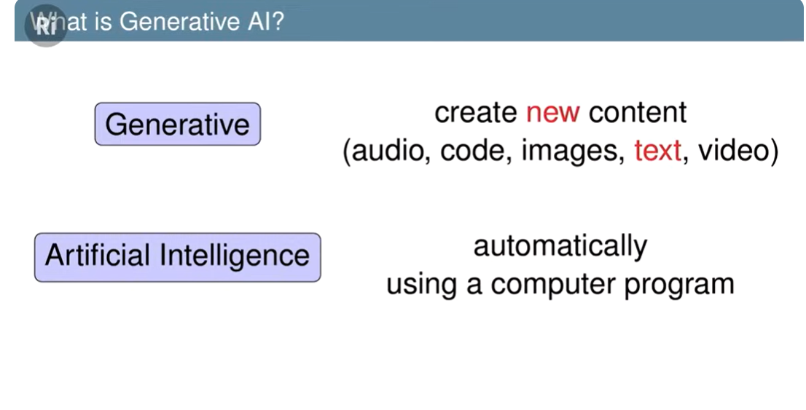
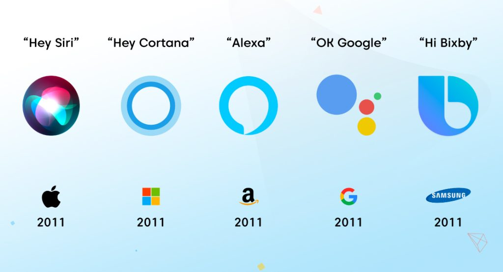
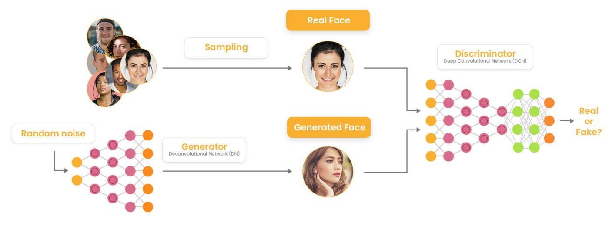
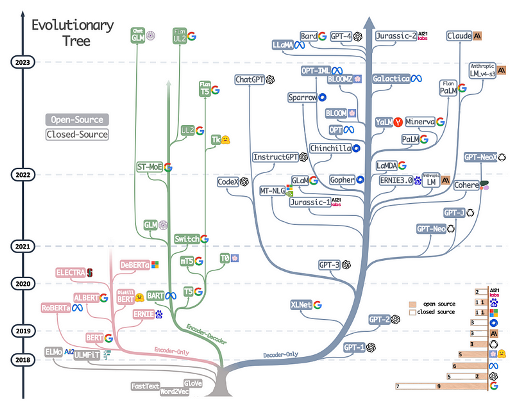

# AI Tools

| Title                                      | Description                                                                                                       | Link                                                     |
|--------------------------------------------|-------------------------------------------------------------------------------------------------------------------|----------------------------------------------------------|
| You.com                                    | A platform offering AI tools and solutions.                                                                        | [You.com](https://you.com/)                             |
| Pi                                         | Discover AI tools and resources for various applications.                                                         | [Pi](https://pi.ai/discover)                            |
| Groq                                       | Explore advanced AI technologies and solutions.                                                                    | [Groq](https://groq.com/)                               |
| Perpexility Labs                          | Access AI labs and resources for research and development.                                                        | [Perpexility Labs](https://labs.perplexity.ai/)         |
| Groq Github                                | Access Groq's AI technologies and projects on GitHub.                                                             | [Groq Github](https://github.com/groq/groq-python)       |
| ChatGPT for DevOps: Introducing Kubiya.ai | Learn about ChatGPT for DevOps and its application in Kubiya.ai.                                                   | [ChatGPT for DevOps: Introducing Kubiya.ai](https://www.kubiya.ai/) |
| Ollama                                     | Discover AI-powered tools and resources for various applications.                                                  | [Ollama](https://ollama.com/library/gemma)              |
| My Collection                              | A beginner-friendly guide to the world of LLMS and AI advancements.                                                | [My Collection](https://medium.com/@amanatulla1606/unveiling-the-world-of-llms-and-ai-advancements-a-beginner-friendly-guide-49525ce023f8) |

# Agent 

| Title       | Description                                                      | Link                                                |
|-------------|------------------------------------------------------------------|-----------------------------------------------------|
| Devika      | GitHub repository for the Devika agent.                          | [Devika](https://github.com/stitionai/devika)      |
| CrewAI      | Explore CrewAI, an AI-powered platform for various applications. | [CrewAI](https://www.crewai.io/)                    |
| Github crewai | GitHub repository for the CrewAI project.                        | [Github crewai](https://github.com/joaomdmoura/crewai) |
| Autogen     | GitHub repository for the Autogen agent by Microsoft.            | [Autogen](https://github.com/microsoft/autogen)    |
| PraisonAI   | GitHub repository for the PraisonAI agent.                       | [PraisonAI](https://github.com/MervinPraison/PraisonAI/) |
| GPT Engineer | GitHub repository for the GPT Engineer project.                  | [GPT Engineer](https://github.com/gpt-engineer-org/gpt-engineer?tab=readme-ov-file) |
| MetaGPT     | GitHub repository for the MetaGPT project.                       | [MetaGPT](https://github.com/geekan/MetaGPT)       |
| Suno V3     | Access Suno V3, an AI-powered application.                       | [Suno V3](https://app.suno.ai/)                     |

**What is GenerativeAI**

- Generative AI refers to a class of artificial intelligence techniques and algorithms designed to generate new content, data, or outputs that mimic or are similar to those found in the training data it has been exposed to. Instead of simply recognizing patterns in data or making predictions based on existing data, generative AI models can create entirely new content that has never been seen before.

- Generative AI encompasses various approaches, including generative adversarial networks (GANs), autoregressive models, variational autoencoders (VAEs), and others. These models are commonly used in fields such as natural language processing, computer vision, music generation, and more.

Before the advent of large language models (LLMs), such as GPT models, statistical methods were the dominant approach in natural language processing tasks like machine translation. One of the prominent techniques used was Statistical Machine Translation (SMT). Here's how SMT works and how it differs from the techniques used in LLMs:

**1.Statistical Machine Translation (SMT):**

- **Explanation:** SMT is based on statistical models that learn translation patterns from large bilingual corpora. These models estimate the likelihood of translating a source sentence to a target sentence based on observed translations in the training data.  

Example Sentence (Source Language - French):  
"Le chat noir dort sur le tapis."  

Translation Task:  
Translate the sentence from French to English using alignment models, translation models, and language models.  

**Alignment Model:**  

The alignment model identifies word correspondences between the source (French) and target (English) languages.  
For example, it might align "Le" with "The", "chat" with "cat", "noir" with "black", "dort" with "sleeps", and so on.  
**Translation Model:**  

The translation model captures translation patterns between phrases or sub-sentential units in the source and target languages.
For example, it learns that "le chat noir" often translates to "the black cat" and "sur le tapis" translates to "on the carpet".  
**Language Model:**  

The language model estimates the probability of generating a sequence of words in the target language (English).
For example, it ensures that the generated translation is fluent and natural-sounding, taking into account English syntax and semantics.
- **Components:** SMT systems typically consist of alignment models, translation models, and language models. Alignment models learn word alignments between source and target sentences, translation models estimate the translation probabilities of phrases or words, and language models capture the probability of generating target language sentences.  
**Example:** In a basic SMT system, given a source sentence in one language, the model uses statistical probabilities to select the most likely translation in the target language based on the learned patterns from the training data.  
**Tools:** Common tools and frameworks used for building SMT systems include Moses, Phrasal, and Apertium.

Early versions of virtual assistants like Siri utilized machine learning techniques to enhance their performance. These included Hidden Markov Models (HMMs) for speech recognition, supervised learning algorithms for understanding language semantics and classifying user queries, natural language processing (NLP) techniques for processing text input, and feature engineering for extracting relevant information. While effective at the time, modern virtual assistants have evolved to employ more advanced deep learning techniques like recurrent neural networks (RNNs), convolutional neural networks (CNNs), and transformers, enabling higher accuracy, robustness, and adaptability to user inputs and contexts.

**Hidden Markov Models (HMMs):**  

Hidden Markov Models are used for tasks like speech recognition, where the goal is to understand spoken words. Imagine you're talking to a virtual assistant like Siri. It listens to your words and tries to figure out what you're saying. HMMs help by modeling the probabilities of different sounds and words occurring together. For example, if you say "hello," the virtual assistant's HMM might recognize the sequence of sounds and guess that you're greeting it.  
**Supervised Learning Algorithms:**  

Supervised learning algorithms are used to understand the meaning of language and classify user queries. For example, when you ask Siri a question like "What's the weather like today?" it needs to understand that you're asking about the weather and then find the relevant information for you. Supervised learning algorithms are trained on lots of examples of questions and their correct answers to learn how to classify new questions.  
**Natural Language Processing (NLP) Techniques:**  

Natural Language Processing techniques are used to process and understand text input. When you type a message to Siri, it needs to understand the meaning of your words. NLP techniques help by analyzing the structure and meaning of sentences. For example, if you type "Remind me to buy milk tomorrow," NLP techniques help Siri understand that you want to be reminded to buy milk the next day.  
**Feature Engineering:**  

Feature engineering involves extracting relevant information from the input data to help machine learning algorithms make better predictions. For example, if Siri is trying to understand a spoken command, it might extract features like the frequency of different sounds or the length of pauses between words to help the HMM recognize the spoken words more accurately.

# Different GenerativeAI

## **Generative Adversarial Networks (GANs):**

Generative Adversarial Networks (GANs) can be broken down into three parts:

- Generative: To learn a generative model, which describes how data is generated in terms of a probabilistic model.  
- Adversarial: The word adversarial refers to setting one thing up against another. This means that, in the context of GANs, the generative result is compared with the actual images in the data set. A mechanism known as a discriminator is used to apply a model that attempts to distinguish between real and fake images.  
- Networks: Use deep neural networks as artificial intelligence (AI) algorithms for training purposes.

**How does a GAN work?**  
The steps involved in how a GAN works:

- **Initialization:** Two neural networks are created: a Generator (G) and a Discriminator (D).
G is tasked with creating new data, like images or text, that closely resembles real data.
D acts as a critic, trying to distinguish between real data (from a training dataset) and the data generated by G.  
- **Generator’s First Move:** G takes a random noise vector as input. This noise vector contains random values and acts as the starting point for G’s creation process. Using its internal layers and learned patterns, G transforms the noise vector into a new data sample, like a generated image.  
- **Discriminator’s Turn:** D receives two kinds of inputs:
Real data samples from the training dataset.
The data samples generated by G in the previous step. D’s job is to analyze each input and determine whether it’s real data or something G cooked up. It outputs a probability score between 0 and 1. A score of 1 indicates the data is likely real, and 0 suggests it’s fake.  
- **The Learning Process:** Now, the adversarial part comes in:
If D correctly identifies real data as real (score close to 1) and generated data as fake (score close to 0), both G and D are rewarded to a small degree. This is because they’re both doing their jobs well.
However, the key is to continuously improve. If D consistently identifies everything correctly, it won’t learn much. So, the goal is for G to eventually trick D.  
- **Generator’s Improvement:**
When D mistakenly labels G’s creation as real (score close to 1), it’s a sign that G is on the right track. In this case, G receives a significant positive update, while D receives a penalty for being fooled.
This feedback helps G improve its generation process to create more realistic data.  
- **Discriminator’s Adaptation:**
Conversely, if D correctly identifies G’s fake data (score close to 0), but G receives no reward, D is further strengthened in its discrimination abilities.  
This ongoing duel between G and D refines both networks over time.
As training progresses, G gets better at generating realistic data, making it harder for D to tell the difference. Ideally, G becomes so adept that D can’t reliably distinguish real from fake data. At this point, G is considered well-trained and can be used to generate new, realistic data samples.

**Application Of Generative Adversarial Networks (GANs)**  
GANs, or Generative Adversarial Networks, have many uses in many different fields. Here are some of the widely recognized uses of GANs:

**Image Synthesis and Generation :** GANs are often used for picture synthesis and generation tasks,  They may create fresh, lifelike pictures that mimic training data by learning the distribution that explains the dataset. The development of lifelike avatars, high-resolution photographs, and fresh artwork have all been facilitated by these types of generative networks.  
**Image-to-Image Translation :** GANs may be used for problems involving image-to-image translation, where the objective is to convert an input picture from one domain to another while maintaining its key features. GANs may be used, for instance, to change pictures from day to night, transform drawings into realistic images, or change the creative style of an image.  
**Text-to-Image Synthesis :** GANs have been used to create visuals from descriptions in text. GANs may produce pictures that translate to a description given a text input, such as a phrase or a caption. This application might have an impact on how realistic visual material is produced using text-based instructions.  
**Data Augmentation :** GANs can augment present data and increase the robustness and generalizability of machine-learning models by creating synthetic data samples.  
**Data Generation for Training :** GANs can enhance the resolution and quality of low-resolution images. By training on pairs of low-resolution and high-resolution images, GANs can generate high-resolution images from low-resolution inputs, enabling improved image quality in various applications such as medical imaging, satellite imaging, and video enhancement.

##**Variational AutoEncoders(VAE)**

Variational Autoencoders (VAEs) are a type of generative model used in unsupervised learning tasks, particularly in the field of deep learning and neural networks. They are an extension of traditional autoencoders, which are neural network architectures used for dimensionality reduction and feature learning. VAEs aim to learn the underlying probability distribution of input data in an unsupervised manner and generate new data samples similar to the training data.

**Why it was introduced:**

- Variational Autoencoders (VAEs) were introduced to address some limitations of traditional autoencoders. Autoencoders are neural networks used for unsupervised learning tasks, such as data compression, denoising, and feature learning. They consist of an encoder network that compresses the input data into a latent space representation and a decoder network that reconstructs the original input data from the latent space representation.

- However, traditional autoencoders have some drawbacks:

- They don't provide a probabilistic framework for generating new data samples.
They don't explicitly learn a distribution over the latent space.
They can generate only a fixed set of data samples from the input distribution.
VAEs were introduced to overcome these limitations by introducing a probabilistic approach to learning latent representations. They provide a way to generate new data samples by sampling from a learned distribution in the latent space, allowing for more flexibility and diversity in the generated samples.

**Architecture:**

- The architecture of a VAE consists of three main components:

- **Encoder Network:** This part of the network takes the input data and maps it to a distribution in the latent space. Unlike traditional autoencoders, the encoder network of a VAE outputs the parameters (mean and variance) of a Gaussian distribution that represents the latent space.

- **Latent Space:** The latent space is the low-dimensional representation of the input data where the data is mapped by the encoder network. It represents the underlying structure or features of the input data.

- **Decoder Network:** This part of the network takes samples from the latent space (usually drawn from the Gaussian distribution) and reconstructs the original input data. The decoder network learns to generate realistic data samples from the latent space representation.

**Example:**

- Imagine you have a dataset of handwritten digits (like the MNIST dataset). A traditional autoencoder would learn to compress each image into a fixed-size vector in the latent space, and then reconstruct the original image from this vector. However, it wouldn't capture the variability in how each digit can be written.

- On the other hand, a VAE would learn to map each digit image to a distribution in the latent space, capturing the variability in how each digit can be represented. This allows the VAE to generate new digit images by sampling from this distribution and decoding the samples into realistic images.

- In simpler terms, while autoencoders learn fixed representations of input data, VAEs learn probabilistic representations that capture the uncertainty and variability in the data, allowing for more flexible and diverse generation of new samples.

**Example: Generating Molecular Structures**

- Imagine you're working in drug discovery, and you want to generate new molecular structures that could potentially be candidates for new drugs. Each molecule can be represented as a sequence of atoms and bonds, and you want to learn a model that can generate new molecular structures.

Traditional Autoencoder Approach:  
- With a traditional autoencoder, you would train a neural network to learn a mapping from the input molecular structures to a fixed-size vector in the latent space and then back to the reconstructed molecular structures. The encoder compresses the input molecules into a fixed-size vector, and the decoder reconstructs the original molecules from this vector.

- However, traditional autoencoders may not capture the diverse and realistic variations in molecular structures, limiting their ability to generate new and meaningful molecules.  

Variational Autoencoder Approach:  
- Now, let's consider using a Variational Autoencoder (VAE) for this task. In a VAE, instead of learning deterministic mappings, we learn probabilistic mappings that capture the variability in the latent space.

- **Encoder Network:** The encoder network takes the input molecular structures and maps them to a distribution in the latent space. Instead of outputting a fixed-size vector, the encoder outputs the parameters (mean and variance) of a multivariate Gaussian distribution that represents the latent space.

- **Sampling from Latent Space:** During training, we sample from this Gaussian distribution to get points in the latent space. These samples represent different variations or styles of molecular structures.

- **Decoder Network:** The decoder network takes these samples from the latent space and reconstructs the original input molecular structures. The decoder learns to generate realistic molecular structures corresponding to different samples from the latent space.

By learning a distribution over the latent space, VAEs capture the diversity in molecular structures and can generate new molecules by sampling from the learned distribution and decoding the samples into realistic molecular structures.

## **Autoregressive Models:**

- Autoregressive models are a type of statistical model used in time series analysis and sequence generation tasks. The term "autoregressive" refers to the idea that each element in the sequence is predicted based on previous elements in the same sequence. This means that the model learns the conditional probability distribution of each element given its past elements.

- The name "autoregressive" stems from the fact that the model regresses on its own past outputs to predict future outputs in a sequence. Each element in the sequence is predicted based on the previous elements, making it "auto" and "regressive" in nature. This modeling approach has proven to be effective in capturing dependencies and patterns in sequential data, leading to its widespread adoption in various applications, particularly in natural language processing.

##**Large Language Model**

**"LLM" stands for "Large Language Model."** This term is used to refer to language models that are exceptionally large in terms of the number of parameters and the amount of training data used to train them. LLMs are characterized by their ability to understand and generate human-like text across a wide range of tasks, including natural language understanding (NLU) and natural language generation (NLG).

**The best definition of an LLM could be:**

- "A Large Language Model (LLM) is a powerful artificial intelligence model that uses deep learning techniques, typically based on neural networks, to understand and generate human-like text. LLMs are trained on vast amounts of text data and learn to capture the complex patterns and structures of natural language. They are capable of performing a variety of language-related tasks, such as text generation, summarization, translation, question answering, and more. LLMs have significantly advanced the field of natural language processing (NLP) and have applications in various domains, including content generation, virtual assistants, chatbots, sentiment analysis, and information retrieval."

**Why it is called language model:**

- In the context of "Large Language Models" (LLMs), the term "language model" specifically refers to the neural network architectures used to process and generate human-like text. These models, which are typically trained using deep learning techniques, learn to understand and generate text based on the patterns and structures present in the training data. Therefore, they are called "language models" because they model the language in a way that allows them to generate coherent and contextually relevant text.

