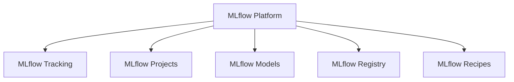

# Session 1 - Introduction to ML Flow

MLflow is an open-source platform designed to manage the machine learning lifecycle. It provides tools and functionality to streamline the process of developing, training, and deploying machine learning models. Here's a detailed explanation of MLflow's key components and features:

1. MLflow Tracking:
   - Allows you to log parameters, code versions, metrics, and output files when running machine learning code.
   - Provides a UI to visualize and compare results from different runs.
   - Supports automatic logging from popular machine learning libraries like scikit-learn, TensorFlow, and PyTorch.

2. MLflow Projects:
   - Provides a standard format for packaging reusable data science code.
   - Enables reproducibility by defining dependencies and environment specifications.
   - Supports running projects locally or on various execution backends like Kubernetes or cloud platforms.

3. MLflow Models:
   - Offers a standard format for packaging machine learning models that can be used in various serving environments.
   - Supports multiple flavors for deployment, including Python functions, scikit-learn models, TensorFlow models, and more.
   - Provides built-in deployment tools for serving models as REST APIs or batch inference jobs.

4. MLflow Registry:
   - Centralized model store for managing the full lifecycle of MLflow Models.
   - Provides model lineage, versioning, stage transitions, and annotations.
   - Enables collaboration between data scientists and engineers in model development and deployment.

5. MLflow Recipes (formerly MLflow Pipelines):
   - Provides a standardized approach to developing production-ready machine learning pipelines.
   - Offers pre-built templates for common ML tasks like regression and classification.
   - Supports customization and extension of pipeline stages.

Key features and benefits of MLflow:

1. Language and framework agnostic: Works with any machine learning library and programming language.

2. Experiment tracking: Helps organize and compare machine learning experiments easily.

3. Reproducibility: Ensures that experiments can be reproduced and shared among team members.

4. Model packaging and deployment: Simplifies the process of packaging models and deploying them to various environments.

5. Integration with popular tools: Integrates well with other data science and ML tools like Jupyter notebooks, scikit-learn, TensorFlow, and cloud platforms.

6. Scalability: Can be used for small projects on a local machine or scaled to large, distributed environments.

7. Extensibility: Provides APIs and plugins to extend functionality and integrate with custom tools and workflows.

Using MLflow typically involves the following steps:

1. Set up an MLflow tracking server or use a hosted solution.
2. Instrument your ML code with MLflow tracking calls to log parameters, metrics, and artifacts.
3. Use MLflow Projects to package your code and dependencies for reproducibility.
4. Save your trained models using MLflow Models for easy deployment.
5. Use the MLflow UI or API to compare and analyze experiment results.
6. Deploy your models using MLflow's deployment tools or integrate with your existing infrastructure.

MLflow has gained popularity in the machine learning community due to its simplicity, flexibility, and ability to address common challenges in the ML lifecycle. It's particularly useful for organizations looking to standardize their ML development process and improve collaboration between data scientists and engineers.

Would you like me to elaborate on any specific aspect of MLflow?

### What is Experiment Tracking?

**Experiment Tracking** is the process of meticulously documenting and managing every aspect of machine learning (ML) experiments. This encompasses:

- **Configurations**: Hyperparameters, feature sets, and other settings used in the experiments.
- **Code Versions**: The specific versions of the codebase and libraries used.
- **Datasets**: The training, validation, and test datasets employed.
- **Metrics**: Performance metrics such as accuracy, precision, recall, F1 score, etc.
- **Results**: The outcomes of the experiments, including the final models and their performance.

### Experiment Tracking in MLOps

**MLOps** (Machine Learning Operations) integrates machine learning into the broader DevOps practices to streamline and standardize the deployment, monitoring, and governance of ML models. Experiment tracking is a crucial part of MLOps because it ensures that the process of developing and refining ML models is structured, repeatable, and efficient.

### Why It's Used in MLOps

1. **Reproducibility**:
   - Ensures that experiments can be repeated with the same settings, aiding in the verification and validation of results. This is essential for scientific rigor and for debugging issues that arise in production.

2. **Comparison**:
   - Facilitates the comparison of different models and experiments to identify the best-performing one. By having detailed records of each experiment, data scientists can systematically evaluate which models perform best under various conditions.

3. **Collaboration**:
   - Allows team members to share and review each other's work, enhancing collaboration. When experiment details are logged and shared, it becomes easier for team members to build on each other’s work and collectively improve model performance.

4. **Efficiency**:
   - Saves time by avoiding redundant work and helps in quickly finding the optimal model settings. Experiment tracking helps in organizing and managing experiments, making it easier to avoid unnecessary duplication of efforts.

5. **Auditability**:
   - Maintains a comprehensive history of all experiments, which is useful for tracking progress and ensuring compliance with regulatory and governance standards. This historical record can be invaluable for understanding the development process and for conducting audits.

### Implementing Experiment Tracking

To implement experiment tracking effectively, the following practices are recommended:

- **Use Experiment Tracking Tools**: Tools like MLflow, Weights & Biases, and Neptune offer robust platforms for tracking experiments, managing datasets, and logging metrics.
- **Automate Tracking**: Automate the logging of configurations, metrics, and results as part of the ML pipeline to ensure consistency and reduce manual effort.
- **Version Control**: Use version control systems like Git to manage code versions and integrate with experiment tracking tools for seamless tracking.
- **Centralized Storage**: Store all experiment data in a centralized location accessible to all team members to facilitate collaboration and ensure data integrity.
- **Documentation and Reporting**: Regularly document and report on experiment progress and results to maintain transparency and enable informed decision-making.

By implementing these practices, organizations can ensure that their ML experiments are well-documented, reproducible, and efficient, ultimately leading to better and more reliable ML models.

### Where Does MLflow Fit?

MLflow is an open-source platform designed to manage the complete machine learning lifecycle. It covers various stages, from experimentation to deployment and monitoring. Here's how MLflow fits into each stage:

#### 1. Experimentation:
- **Tracking**: MLflow’s tracking component helps log parameters, metrics, and artifacts of each experiment. This comprehensive logging ensures that all experiment details are recorded for future comparison and analysis. It helps in keeping a detailed history of experiments, which is crucial for reproducibility and comparison.

#### 2. Model Development:
- **Projects**: MLflow Projects provide a standardized way to package and share machine learning code. By defining the dependencies and environment settings in a `MLproject` file, it ensures that experiments can be run consistently across different environments. This standardization helps in maintaining consistency and collaboration among team members.

#### 3. Model Validation:
- **Tracking**: During the model validation phase, MLflow continues to log validation metrics and results. This ongoing tracking makes it easier to evaluate model performance over different datasets and conditions, ensuring the model's robustness and reliability.

#### 4. Deployment:
- **Models**: MLflow’s model registry allows you to register, version, and deploy models seamlessly. Models can be served directly via APIs or integrated into existing systems. The registry provides a centralized repository for all models, enabling easy access and management of different model versions.

#### 5. Monitoring:
- **Tracking**: MLflow aids in monitoring deployed models by logging predictions and performance metrics in real-time. This tracking ensures that models remain effective and helps in detecting any degradation in performance, allowing for timely interventions and updates.

#### 6. Lifecycle Management:
- **Comprehensive Management**: MLflow covers the entire machine learning lifecycle from development to deployment and monitoring. It integrates various stages seamlessly, providing tools and frameworks that support experiment tracking, model development, validation, deployment, and monitoring. This lifecycle management ensures that the process is streamlined, efficient, and manageable.

By fitting into each of these stages, MLflow provides a unified platform that supports the end-to-end machine learning workflow. It helps in making the machine learning process more organized, reproducible, and collaborative, ultimately leading to more reliable and effective models.

# MLflow: The Comprehensive Guide to ML Lifecycle Management 🚀

## Table of Contents 📑
1. [Introduction to MLflow](#introduction)
2. [Key Components](#components)
3. [Experiment Tracking Deep Dive](#tracking)
4. [MLflow in MLOps Lifecycle](#mlops)
5. [Implementation Guide](#implementation)

<a name="introduction"></a>
## 1. Introduction to MLflow 🌟

MLflow is an open-source platform revolutionizing machine learning lifecycle management. It provides a comprehensive suite of tools designed to streamline ML development, training, and deployment processes.

### Core Philosophy 🎯
- **Open-source** and community-driven
- **Language-agnostic** architecture
- **Framework-independent** design
- **Scalable** from local to enterprise deployments

<a name="components"></a>
## 2. Key Components 🔧

### 2.1 MLflow Architecture


### 2.2 Component Breakdown

| Component | Primary Function | Key Features |
|-----------|-----------------|--------------|
| MLflow Tracking | Experiment logging | Parameters, metrics, artifacts logging |
| MLflow Projects | Code packaging | Reproducibility, dependency management |
| MLflow Models | Model packaging | Multi-flavor deployment support |
| MLflow Registry | Model management | Versioning, stage transitions |
| MLflow Recipes | Pipeline standardization | Pre-built templates, customization |

<a name="tracking"></a>
## 3. Experiment Tracking Deep Dive 📊

### 3.1 What is Experiment Tracking? 🤔

> **Definition**: Experiment tracking is the systematic process of documenting and managing all aspects of machine learning experiments.

### 3.2 Key Tracking Elements

```python
# Example of MLflow tracking implementation
import mlflow

with mlflow.start_run():
    # Log parameters
    mlflow.log_param("learning_rate", 0.01)
    
    # Log metrics
    mlflow.log_metric("accuracy", 0.95)
    
    # Log artifacts
    mlflow.log_artifact("model.pkl")
```

### 3.3 Tracking Components 📋

- **Configurations** ⚙️
  - Hyperparameters
  - Feature engineering settings
  - Model architectures

- **Code Versions** 💻
  - Source code snapshots
  - Library dependencies
  - Environment specifications

- **Datasets** 📁
  - Training data
  - Validation sets
  - Test datasets

- **Metrics** 📈
  - Performance indicators
  - Training statistics
  - Validation results

<a name="mlops"></a>
## 4. MLflow in MLOps Lifecycle 🔄

### 4.1 Integration Points

| Stage | MLflow Component | Function |
|-------|-----------------|-----------|
| Experimentation | Tracking | Log experiments and results |
| Development | Projects | Package code and dependencies |
| Validation | Models | Test and validate models |
| Deployment | Registry | Manage model versions |
| Monitoring | Tracking | Monitor performance metrics |

### 4.2 Benefits in MLOps 🎯

1. **Reproducibility** ♻️
   - Consistent environment specifications
   - Version-controlled experiments
   - Reproducible results

2. **Collaboration** 👥
   - Shared experiment tracking
   - Centralized model registry
   - Team-wide visibility

3. **Efficiency** ⚡
   - Automated logging
   - Streamlined deployment
   - Quick experiment comparison

4. **Auditability** 📋
   - Complete experiment history
   - Model lineage tracking
   - Compliance documentation

<a name="implementation"></a>
## 5. Implementation Guide 💡

### 5.1 Setup Process

```bash
# Install MLflow
pip install mlflow

# Start MLflow UI
mlflow ui
```

### 5.2 Best Practices 🌟

1. **Experiment Organization**
   ```python
   mlflow.set_experiment("project_name")
   ```

2. **Systematic Logging**
   ```python
   with mlflow.start_run(run_name="experiment_001"):
       mlflow.log_params(params_dict)
       mlflow.log_metrics(metrics_dict)
   ```

3. **Model Management**
   ```python
   mlflow.sklearn.log_model(model, "model")
   ```

### 5.3 Integration Tips 🔧

- Use **automatic logging** when possible
- Implement **consistent naming conventions**
- Maintain **clear documentation**
- Set up **centralized tracking servers**

## Final Thoughts 💭

MLflow provides a robust foundation for managing the machine learning lifecycle. Its comprehensive toolset and flexible architecture make it an invaluable asset in modern ML development and deployment workflows.

> **Pro Tip**: Start with basic tracking and gradually incorporate more advanced features as your needs grow.

---
*Keep experimenting, keep tracking, keep improving!* 🚀
